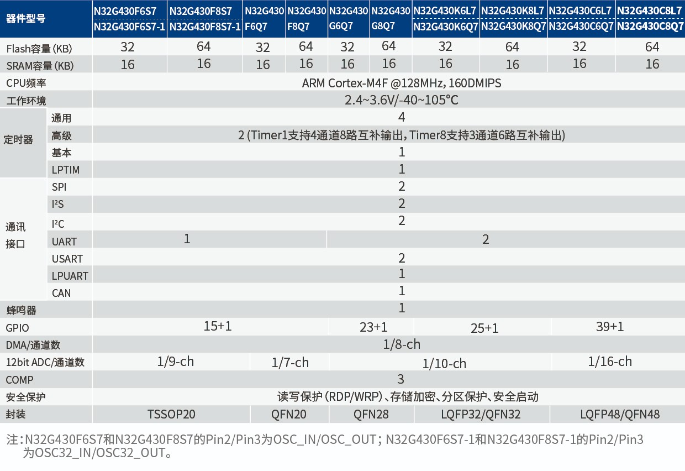

# [N32G430](https://www.soc.xin/N32G430)

* [Nationstech](https://www.nationstech.com/): [Cortex-M4F](https://github.com/SoCXin/Cortex)
* [L2R1](https://github.com/SoCXin/Level): 128 MHz , [￥3.0 (LQFP-32)](https://item.szlcsc.com/3571708.html)

## [简介](https://github.com/SoCXin/N32G430/wiki)

[N32G430](https://www.nationstech.com/N32G430/) 内置1个12bit 4.7Msps ADC，3个高速比较器，集成多路U(S)ART、I2C、SPI、CAN等数字通信接口。

### 关键参数

* 128 MHz Cortex-M4F
* 16KB SRAM + 64KB Flash
* 12-bit ADC 4.7Msps
* 3x CMP
* LPUART + USART + UART + SPI + I2C + CAN

## [资源收录](https://github.com/SoCXin)

* [参考资源](src/)
* [参考文档](docs/)
* [参考工程](project/)

## [选型建议](https://github.com/SoCXin/N32G430)

2022年6月发布的[N32G430](https://item.szlcsc.com/3571707.html)定位高性价比Cortex-M4F MCU，具有出色的ADC性能，可替换早期爆款[AT32F421](https://github.com/SoCXin/AT32F421)，升级的4.7Msps ADC非常强大，外设资源也更丰富。

