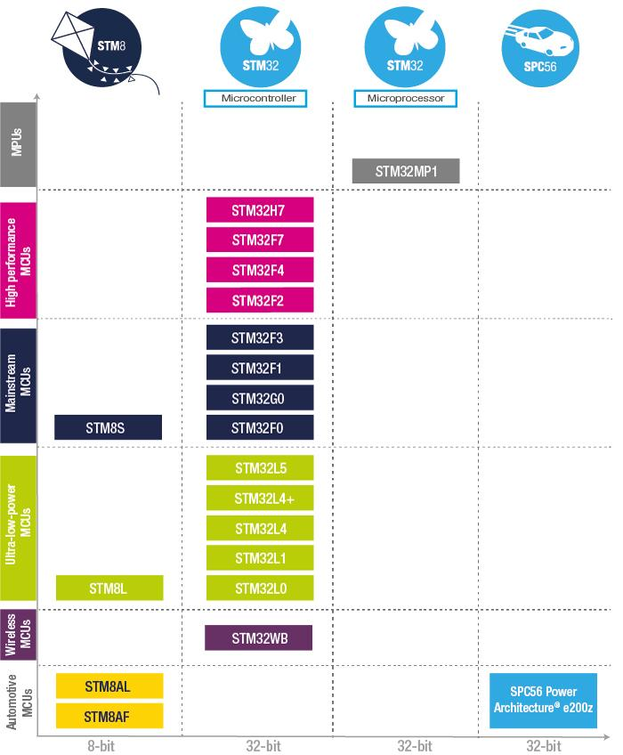

# [ST意法](https://github.com/sochub/ST)

 

#### 父级：[vendor](https://github.com/sochub/vendor) 

[意法半导体](https://www.st.com/content/st_com/zh.html)，全球最大的半导体企业之一，1987年6月由意大利SGS Microelettronica和法国汤姆森半导体公司合并组建成SGS 汤姆森半导体公司，1998年5月改名为意法半导体。

ST是全球性排名前十的独立半导体制造商。公司设计、生产、销售一系列半导体IC和分立器件，用于远程通讯系统、计算机系统、消费电子产品、汽车和工业自动化控制系统。

ST在MCU市场排名前三，给客户带来更高性能、更低功耗、更多样化的MCU。

 

###  [MCU类产品](https://github.com/sochub/ST)  

* [STM8](https://github.com/sochub/STM8) 
	* [STM8L](https://github.com/sochub/STM8L) 
	* [STM8S](https://github.com/sochub/STM8S) 
* [STM32](https://github.com/sochub/STM32) 
	* [STM32F0](https://github.com/sochub/STM32F0) 
	* [STM32F1](https://github.com/sochub/STM32F1) 
	* [STM32F4](https://github.com/sochub/STM32F4) 
	* [STM32L1](https://github.com/sochub/STM32L1) 
	* [STM32L0](https://github.com/sochub/STM32L0) 

### [选型建议](https://github.com/sochub/ST)

相比其他MCU产品，ST在个人开发者手中更为常见，个人能够找到的资源也更全面，通过面向开发者的策略逐渐被更多的商业市场认可，特别是在用量不大，主要是开发成本的长尾市场上拥有极高的性价比和优势。

但ST毕竟不是国产，人命币和美元之间的性价比是有鸿沟的，所以在重点关注性价比的场合，我们也需要找到更有优势的替换者，最佳的策略是通过整体BOM成本考虑，选择最佳的SoC方案，其次是同类厂商间的替换，ST的可替代厂商主要有：
*  [北京兆易](https://github.com/sochub/gigadevice) 
*  [台湾新塘](https://github.com/sochub/nuvoton) 

##  [SoC资源平台](http://www.qitas.cn)